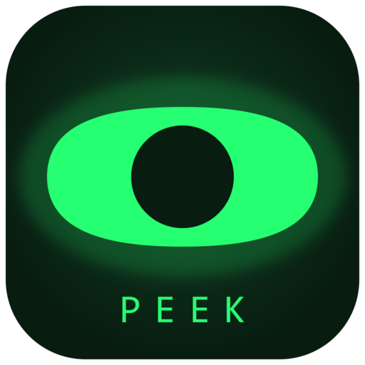

  
  <h1 align="center">Peek</h1>
  

  Not just a screen reader — a way to see your screen, however you need to.
  

## Why Peek

 Most screen readers give you the words on screen. Peek gives you the machine itself — the windows, processes, and UI structure behind every control, not just what's spoken aloud. Every setting exists because someone needed to reach further into their computer, not because a checklist demanded it.

It's local-first, and built to keep growing rather than ship-and-forget — if you use it every day and
something's missing, that's a bug, not a limitation.

**[Read the user guide →](docs/USER_GUIDE.md)** — shortcuts, speech setup, and how to drive
Peek by keyboard.

## Features

- **Follows your keyboard** — every control you Tab to, in any application, announced as you reach it; you don't have to be able to see where to point a mouse
- **Follows your mouse** — hover any on-screen element to hear what it is, instantly, via native UI Automation
- **Considered announcements, not a read-out** — role and state are only spoken when they add information ("Login, button" — not a recitation of every property), hover and focus are throttled and de-duplicated so fast mouse movement doesn't turn into noise, and a user-requested announcement always takes priority over ambient chatter — nothing queues up to talk over you after you've already moved on.
- **Element Inspector** — browse the full UI tree of any window, not just what's under the cursor
- **AI screen & window analysis** — ask an LLM (OpenAI, Anthropic, Gemini, OpenRouter, Ollama or your own endpoint) to describe what's on screen when accessibility metadata alone isn't enough
- **OCR fallback** — reads text out of images and non-accessible UI when there's nothing else to go on
- **Local, offline text-to-speech** — neural voices via Piper, no cloud dependency, no per-character billing
- **Multi-language out of the box** — English, German, and Chinese, with automatic language detection per utterance
- **App & Process monitors** — launch, inspect, and manage running software without leaving the keyboard
- **Dockable shell** — pin Peek to a screen edge as your home base on screen: whenever things get disorienting elsewhere, it's the one region that never moves and is always there to come back to.

## Open-source dependencies

Peek is built on the following open-source projects:

| Project | License |
| --- | --- |
| [Avalonia](https://avaloniaui.net/) | MIT |
| [Pipboy.Avalonia](https://github.com/NeverMorewd/Pipboy.Avalonia) (+ .Fx, .ProDataGrid) | MIT |
| [ProDataGrid](https://github.com/wieslawsoltes/ProDataGrid) | MIT |
| [AsyncNavigation](https://github.com/NeverMorewd/AsyncNavigation) | MIT |
| [ReactiveUI](https://reactiveui.net/) (+ .Avalonia, .SourceGenerators) / [ReactiveUI.Primitives](https://github.com/reactiveui/Primitives) | MIT |
| [Microsoft.Extensions.*](https://github.com/dotnet/runtime) | MIT |
| [Microsoft.Windows.CsWin32](https://github.com/microsoft/CsWin32) | MIT |
| [Irihi.Lingua](https://github.com/irihitech/Irihi.Lingua) | MIT |
| [SkiaSharp](https://github.com/mono/SkiaSharp) | MIT |
| [System.Drawing.Common](https://github.com/dotnet/winforms) | MIT |
| [LibVLCSharp](https://code.videolan.org/videolan/LibVLCSharp) / [VideoLAN.LibVLC.Windows](https://code.videolan.org/videolan/libvlc-nuget) | LGPL-2.1-or-later |
| [PiperSharp](https://github.com/Lyx52/PiperSharp) / [Piper](https://github.com/rhasspy/piper) | MIT |
| [Sdcb.SimdPaddleOCR](https://github.com/sdcb/SimdPaddleOCR) / [PaddleOCR](https://github.com/PaddlePaddle/PaddleOCR) | Apache-2.0 |

## License

GPL-3.0 — see [LICENSE](LICENSE). Peek is free for everyone: individuals,
companies, government agencies, and non-profits alike. Government and
non-profit organizations can also get free deployment/usage guidance, and
companies can get paid custom development, integration, and consulting — see
[Licensing & Support](LICENSING_AND_SUPPORT.md) for details.
