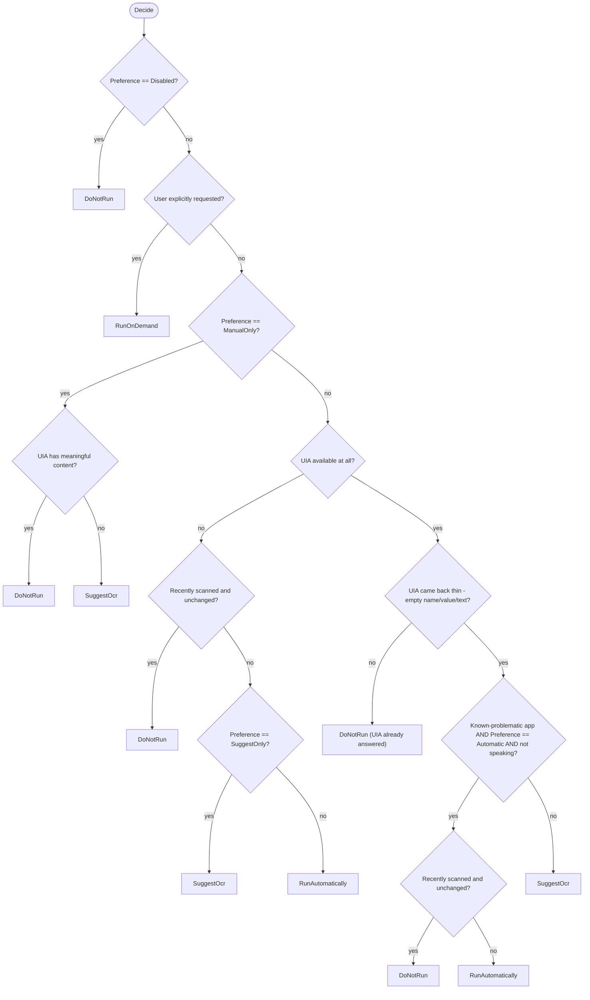
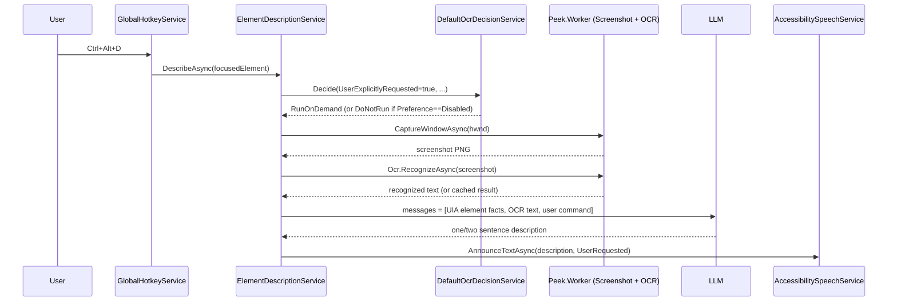
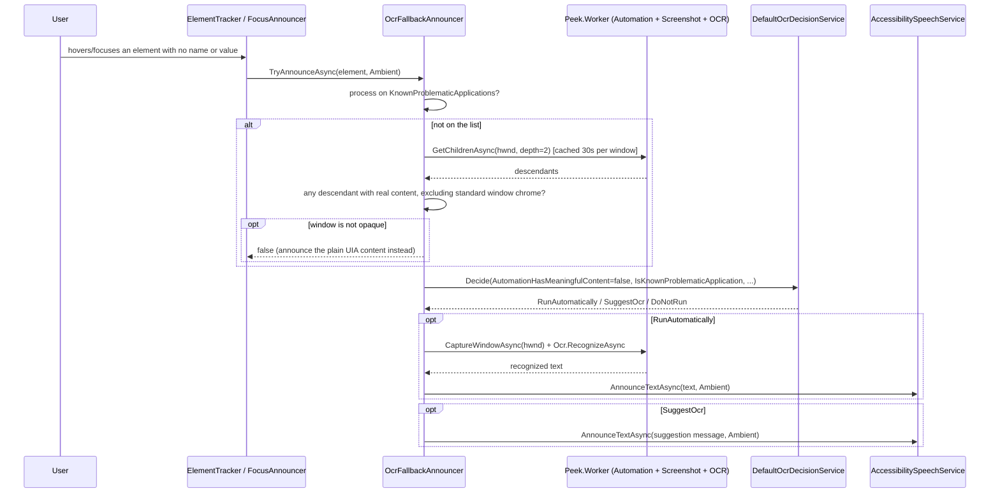
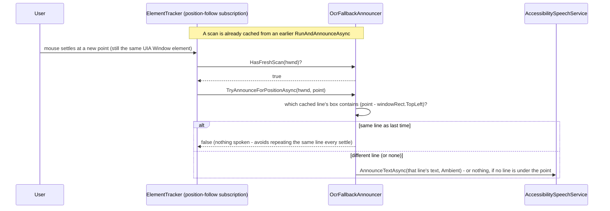

# OCR Strategy

How Peek recognizes on-screen text that UI Automation can't expose, and when it's allowed to.

## Two separate concerns

OCR in Peek is split into two independent pieces on purpose, so the "should we scan?" logic
never needs a running worker, a screenshot, or TTS to be testable:

- **Recognition** (`Peek.Worker.Ocr.SimdPaddleOcrService`, worker-side) - given an image, return
  text. Knows nothing about UI Automation, settings, or speech.
- **Decision** (`Peek.Core.Services.Ocr.DefaultOcrDecisionService`, client-side) - given a
  description of the current situation, decide whether OCR should run at all. Pure function,
  no I/O, fully unit-tested (`DefaultOcrDecisionServiceTests`).

## Recognition engine

- **Sdcb.SimdPaddleOCR**, PP-OCRv6-tiny model, **embedded in the NuGet package** - unlike Piper's
  TTS runtime, there is no first-run download. OCR works fully offline from the first launch.
- Runs against a decoded PNG, optionally cropped to a caller-supplied pixel region
  (`OcrRegion`), converted to BGR for the engine.
- Results are cached by `SHA-256(image bytes + region)` for 3 seconds (`PeekOcrOptions.CacheTtl`),
  capped at 8 entries (`MaxCacheEntries`, oldest evicted first) - a rapid double-request for the
  same crop (e.g. a retry) is served from cache instead of re-running inference.
- Recognized text is never logged (only line count and timing) - it's private UI content.

## Decision engine

`IOcrDecisionService.Decide(OcrDecisionContext) -> OcrDecision` is a pure state machine:

| OcrDecision | Meaning |
| --- | --- |
| `DoNotRun` | Don't scan, don't say anything. |
| `SuggestOcr` | Don't scan automatically, but tell the user more may be available. |
| `RunAutomatically` | Scan without being asked. |
| `RunOnDemand` | Scan because the user explicitly asked right now. |

`OcrDecisionContext` carries the signals the decision reasons over: whether UI Automation was
queryable at all, whether what it returned was actually useful (non-empty name/value/text),
whether the current app is on a configured `KnownProblematicApplications` list, whether the user
explicitly asked, whether the screen changed enough to justify a re-scan, how long since the
last OCR run, whether TTS is currently speaking, and the user's `OcrUserPreference`
(`Automatic` / `SuggestOnly` / `ManualOnly` / `Disabled`).

## Two live paths

**1. User-requested, via AI.** `ElementDescriptionService.DescribeAsync`, wired to the
`DescribeFocusedElement` shortcut (`Ctrl+Alt+D`, an AI "describe this" command, not a plain OCR
command), always sets `UserExplicitlyRequested = true`.

OCR text on this path is never spoken on its own - it's appended as a fact ("Text recognized on
screen via OCR (may contain recognition errors): ...") into the LLM prompt alongside the UIA
element description (`ContextAggregator.BuildMessages`), and the model's answer is what actually
gets spoken.

`ScreenAnalysisService` (the "AI screen & window analysis" feature) is a separate, unrelated
pipeline: it sends the screenshot straight to a vision-capable LLM and never touches OCR.

**2. Ambient, ties directly into the decision engine.** `OcrFallbackAnnouncer` is called by both
`ElementTracker` (hover) and `FocusAnnouncer` (keyboard focus) before they announce a
`SemanticElement`'s (empty) UIA content - this is what closes the gap this doc originally
flagged (see Findings below). Unlike path 1, the recognized text is spoken directly, with no
LLM involved, so it works with AI turned off.

Two signals feed this, deliberately not one:

- **The hovered element itself** has no name/value (`OcrFallbackAnnouncer.HasMeaningfulContent`) -
  cheap, checked first, on every hover/focus. Specifically does **not** count a bare top-level
  `Window` element's own `Name` as content: every real window has a title, so counting it would
  make this check pass for exactly the case that matters - a window whose whole client area
  resolves to one undifferentiated Window element (confirmed against WeChat: every hover position
  returns the same "Weixin, Window", nothing else).
- **The window as a whole** exposes no meaningful descendants anywhere
  (`IsWindowUiaOpaqueAsync`, skipped for apps already on `KnownProblematicApplications`) - a
  one-time-per-window probe (`automation.getChildren`, depth 2, cached 30s), so an app that's
  merely thin *at this one pixel* (an icon button, a blank spacer - completely normal in an
  otherwise fully-accessible app) can be told apart from one that's opaque everywhere, without
  needing every such app hand-listed by name.
  ⚠️ **Gotchas found via testing** (a synthetic reproduction first, then a real Weixin window -
  both surfaced real, distinct false positives):
  - `GetChildrenAsync` still returns the window's title bar, system menu, and
    minimize/maximize/close/context-help buttons even when the app itself exposes nothing -
    every window has these, all with real names ("Minimize", "System Menu Bar", "Context help",
    the window's own title). Counting them made the probe judge *every* window non-opaque.
    Excluded via `OcrFallbackAnnouncer.IsStandardWindowChrome`.
  - Real Weixin's descendants included two `Pane` elements with non-empty but useless names: one
    duplicating the window's own title, one named `MMUIRenderSubWindowHW` - an internal
    rendering-surface class name, not text a user would want read. Readable content lives on
    leaf controls (`Text`, `Edit`, `Button`, `ListItem`, ...), never on a pure layout container
    - regardless of what `Name` UIA happens to report for it - so the probe now also excludes
    purely structural control types (`Pane`, `Group`, `Custom`, `Window`, `ToolBar`, `List`,
    `Tree`, `Table`, ...) via `OcrFallbackAnnouncer.IsStructuralContainer`, counting only leaf/
    content-shaped types as evidence either way.

`DefaultOcrDecisionService.Decide()` itself is unchanged and still only lets
`IsKnownProblematicApplication = true` reach `RunAutomatically` - an unconfirmed, merely-thin
element gets `SuggestOcr` instead. `OcrFallbackAnnouncer` feeds that flag as
`isKnownProblematic || isOpaque`, not `isKnownProblematic` alone: a window that just failed the
whole-tree probe is *stronger* evidence than a name match (it's inspected, not guessed), so it's
trusted exactly as much. That is what makes `KnownProblematicApplications` a pure fast-path
(skip the probe round-trip for a name already known) rather than a requirement - an app nobody
has ever hand-listed still gets read automatically the first time the probe confirms it's
opaque, which matters in practice: a user's existing `settings.json` predating this feature has
`KnownProblematicApplications: []` persisted, and a new default value in code does not retroactively
add to it (see Findings). Both the known-list and probe-only paths are integration-tested
(`ElementTrackerHoverTests`) against a real, purpose-built UIA-opaque window (`OpaqueTestWindow`:
a bare WinForms window with no controls at all, its only text drawn via GDI - the same shape as
WeChat's message list), with and without the process on that list.

## Following the mouse across recognized text

A UIA-backed hover re-announces as soon as the cursor moves to a *different element* - that's
`ElementTracker`'s `DistinctUntilChanged(HoverElementIdentityComparer)`. An OCR-opaque window
breaks that comparison outright: every point inside it resolves to the *same* Window element
(same `Hwnd`/`Name`/`ControlType`/`Rect`), so without something else driving it, OCR would read
the whole window once on entry and then go completely deaf to further mouse movement - a real
regression from how every UIA element behaves.

`ElementTracker` runs a second, independent subscription off raw mouse positions (not off the
UIA-resolved element) specifically to cover this. It never re-runs OCR itself - it only checks
the *already-cached* scan from the most recent `RunAndAnnounceAsync`, so it's cheap enough to
run on every settled position for as long as that cache stays fresh (`ScanCacheTtl`, 30s):

The very first announcement for a newly-opaque window is also position-aware: `ElementTracker`
tracks the latest raw mouse position independently (a plain field, updated on every position
regardless of throttling) and hands it to the initial `TryAnnounceAsync` call, so
`RunAndAnnounceAsync` reads the specific line already under the cursor rather than the whole
recognized blob, using the exact same line-lookup (`FindLineAt`, a bounding-box hit test against
each `OcrLine.Box`) the position-follow subscription uses afterward.

`FocusAnnouncer` passes no point at all (there's no cursor position associated with a keyboard
focus event) - a focus-driven OCR read always gets the whole window's recognized text, with no
line-level follow, since there is no meaningful position to follow.

Integration-tested (`Moving_to_a_different_line_in_a_UIA_opaque_window_announces_that_line`):
two lines of GDI-drawn text in `OpaqueTestWindow`, hovering the first gets it via the normal
scan, then - without ever re-resolving a different UIA element - moving to the second gets that
one specifically, proving the position-follow path is what's doing it, not the UIA pipeline.

## Spoken cue while OCR is running

A screenshot + `Ocr.RecognizeAsync` round trip is the one genuinely slow step on the ambient
path - typically a few hundred milliseconds, more on a large or high-DPI window - which without
anything else is silence that's indistinguishable from "nothing is going to happen" for a
screen-reader user. `RunAndAnnounceAsync` speaks a short cue
(`OcrFallbackAnnouncer.FormatExtractingMessage`, e.g. "Extracting text from Weixin, one
moment...") immediately before the screenshot/OCR calls, at the same `Ambient` priority as the
real announcement that follows. No special handling is needed for the common fast-OCR case where
this gets cut off almost immediately - it relies on the same "a newer announcement interrupts an
older one" rule every other ambient announcement already follows.

## Highlight follows individual OCR lines

The visual highlight box has the same "same UIA element the whole time" problem speech did (see
above), and is fixed the same way, but on its own path: `ElementTracker.StartTrackingCore`'s
per-mouse-sample highlight callback (`TrackMouseElement`'s ~25ms follow interval - much faster
than the throttled speech pipeline) calls a new synchronous, cache-only
`OcrFallbackAnnouncer.TryGetLineScreenRect(hwnd, point)` before falling back to the whole
element's rect. A hit returns the matched line's bounding box in screen coordinates, inflated by
one pixel in each of width and height (an OCR quad's tight bounds can otherwise clip the glyphs
an outline drawn at the exact same size is meant to frame).

This deliberately reuses `FindLineAt`'s bounding-box lookup (factored out into
`GetLineBounds`) rather than introducing a second notion of "which line is this point over" -
the same cached scan that drives speech drives the highlight, just read more often and never
mutated by it. Integration-tested
(`Highlight_follows_individual_OCR_lines_once_a_scan_is_cached`) against the same two-line
`OpaqueTestWindow`: once a scan is cached, the recorded highlight rect shrinks from the whole
420x300 test window down to a single line's box.

⚠️ **Gotcha found while testing this:** `TrackMouseElement`'s own query pipeline applies
`DistinctUntilChanged` to raw mouse positions *before* sampling
(`WorkerClientExtensions.TrackMouseElement`), so pushing the exact same point twice never
re-triggers the highlight callback at all - only a step used by the ambient *speech*
position-follow subscription, which reads raw positions directly with no such dedup. A test (or
a future caller) driving the highlight path has to vary the position by at least one pixel to see
it update again.

## Findings

1. ~~The automatic/suggested branches of the decision engine are unreachable in production.~~
   **Fixed.** Both `RunAutomatically` (any confirmed-opaque window, listed or not) and
   `SuggestOcr` (the remaining decision-engine cases - `SuggestOnly` preference, or a
   known/opaque window while something is already speaking) are live and integration-tested -
   `OcrUserPreference`, `IsSpeaking`, and the 2-second re-run throttle all actually matter, and
   `SuggestionMessage`/`OcrSuggestionMessages.Default` gets spoken when they apply.
2. **OCR still can't run standalone from the `Ctrl+Alt+D`/AI path.** `ElementDescriptionService
   .DescribeAsync` still returns immediately with "AI description is turned off in settings"
   before ever consulting `OcrDecisionService` if `Settings.Ai.Enabled` is false. Ambient OCR
   (path 2) is unaffected by this - it works regardless of the AI setting - but the explicit
   "describe this" shortcut itself still has no effect with AI off, even though the OCR half of
   it doesn't inherently need AI.
3. **A default value change in code does not retroactively update an existing `settings.json`.**
   This is what made testing this fix initially look like it wasn't working at all: seeding
   `KnownProblematicApplications` with `Weixin`/`WeChat` only affects a settings file created
   *after* the change - anyone who had already run Peek has `[]` persisted on disk, which wins
   over the new code default on load. Not fatal now that the probe alone is enough to trigger a
   full read (see above), but worth remembering for the next time a shipped default changes:
   either accept that existing installs won't see it, or add an explicit migration step keyed
   off a settings version number. There's also still no Settings UI for this list - only
   `settings.json` by hand.
4. **`ScreenChangedSignificantly` is never actually computed.** `OcrFallbackAnnouncer` always
   passes the context's default (`false`), so a known-problematic window that's re-hovered after
   its content changed (e.g. new chat messages arrived) but within the 2-second
   `MinRerunInterval` window will report stale, cached text rather than re-scanning. Comparing
   the new screenshot's hash against the last one (already computed once for the OCR service's
   own cache key) would be a cheap way to detect this.
5. **The opacity probe's depth (2), chrome exclusion list, and structural-container list are
   judgment calls, not exhaustive.** Two rounds of testing against real apps (a synthetic
   reproduction, then a real Weixin window) each turned up a distinct false positive the probe
   hadn't accounted for yet (see the gotchas above) - both are fixed, but a *different* app could
   still expose some other structural-but-named element neither list anticipates, producing a
   false "not opaque" that silently skips OCR. This class of bug is only found by testing against
   more real UIA-hostile apps, not by reasoning about it in the abstract.
6. **`OcrFallbackAnnouncer`'s trace logging was originally `Debug`**, one level below the app's
   default `MinimumLogLevel` (`Information`) - so a user's log showed nothing at all from this
   class regardless of whether it ran, made the wrong decision, or was never reached, which is
   exactly the question a bug report about it needs answered. The lines that explain an outcome
   (whether the window was judged opaque, what the decision engine returned, and - temporarily -
   exactly which descendant made a window non-opaque) are now `Information`; only the routine
   internals (e.g. a successful screenshot/OCR round trip) stay at `Debug`. The temporary one
   (`IsWindowUiaOpaqueAsync`'s "not opaque because of: ..." line) should drop back to `Debug`, or
   be removed, once finding 5 above stops needing it.
7. **The position-follow subscription assumes `CaptureWindowAsync`'s rect and UIA's `Rect` agree
   on the same coordinate space.** Both come from Win32 (`GetWindowRect` and UIA's
   `BoundingRectangle` respectively), which should match for an ordinary single-monitor/uniform-
   DPI setup, but per-monitor DPI scaling or a non-DPI-aware window are the kind of edge case
   that could make the two disagree by a scale factor - untested, since reproducing a genuine
   per-monitor-DPI mismatch needs actual mixed-DPI hardware, not something a synthetic test
   window run on one monitor can exercise.
8. **A resized, scrolled, or re-rendered window invalidates the cached scan silently.** The
   position-follow subscription has no way to know the window's content moved since the last
   `RunAndAnnounceAsync` - it will keep reporting line positions from a stale screenshot until
   the 30-second `ScanCacheTtl` expires or a fresh hover-driven scan happens to run. Combined
   with finding 4 (`ScreenChangedSignificantly` never computed), a window whose content updates
   frequently (exactly the chat-message case this feature targets) can drift out of sync with
   what's actually on screen for up to 30 seconds at a time.
