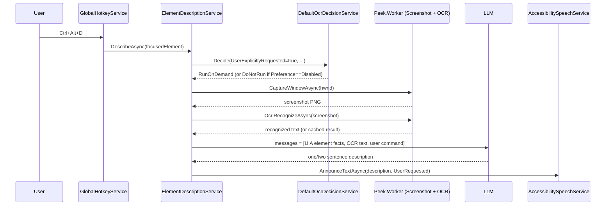
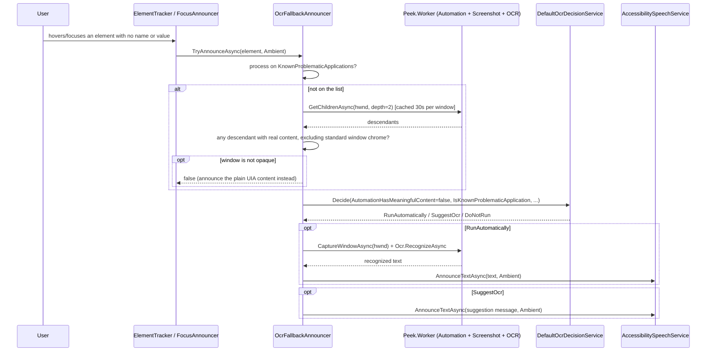
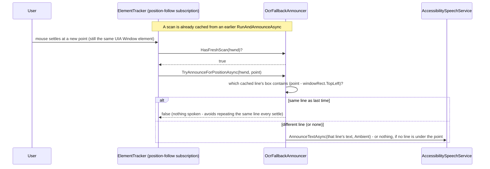

# OCR Strategy

How Peek recognizes on-screen text that UI Automation can't expose, and when it's allowed to.

## Two separate concerns

OCR splits into two independent pieces, so "should we scan?" never needs a running worker, a
screenshot, or TTS to be testable:

- **Recognition** (`Peek.Worker.Ocr.SimdPaddleOcrService`, worker-side) - given an image, return
  text. Knows nothing about UI Automation, settings, or speech.
- **Decision** (`Peek.Core.Services.Ocr.DefaultOcrDecisionService`, client-side) - given a
  description of the situation, decide whether OCR should run at all. Pure function, no I/O,
  fully unit-tested (`DefaultOcrDecisionServiceTests`).

## Recognition engine

- **Sdcb.SimdPaddleOCR**, PP-OCRv6-tiny model, embedded in the NuGet package - no first-run
  download, unlike Piper's TTS runtime. OCR works offline from the first launch.
- Runs against a decoded PNG, optionally cropped to a caller-supplied pixel region (`OcrRegion`),
  converted to BGR for the engine.
- Results are cached by `SHA-256(image bytes + region)` for 3 seconds (`PeekOcrOptions.CacheTtl`),
  capped at 8 entries (oldest evicted first) - a rapid double-request for the same crop is served
  from cache.
- Recognized text is never logged (only line count and timing); it's private UI content.

## Decision engine

`IOcrDecisionService.Decide(OcrDecisionContext) -> OcrDecision` is a pure state machine:

| OcrDecision | Meaning |
| --- | --- |
| `DoNotRun` | Don't scan, don't say anything. |
| `SuggestOcr` | Don't scan automatically, but tell the user more may be available. |
| `RunAutomatically` | Scan without being asked. |
| `RunOnDemand` | Scan because the user explicitly asked right now. |

In words, top to bottom: `DoNotRun` if the preference is `Disabled`; otherwise `RunOnDemand` if
the user explicitly asked. Past that, if the preference is `ManualOnly`, it's `DoNotRun` when
UIA already has meaningful content and `SuggestOcr` when it doesn't. Otherwise, with no UIA
available at all, a recent unchanged scan means `DoNotRun`; failing that, `SuggestOcr` if the
preference is `SuggestOnly`, else `RunAutomatically`. If UIA *is* available but came back thin
(empty name/value/text), a known-problematic app that isn't currently speaking and isn't a
recent unchanged scan gets `RunAutomatically`; every other thin-UIA case gets `SuggestOcr`.
Non-thin UIA content always means `DoNotRun` - UIA already answered.

`OcrDecisionContext` carries the signals: whether UI Automation was queryable at all, whether
what it returned was actually useful, whether the current app is on `KnownProblematicApplications`,
whether the user explicitly asked, whether the screen changed enough to justify a re-scan, time
since the last run, whether TTS is speaking, and `OcrUserPreference` (`Automatic` /
`SuggestOnly` / `ManualOnly` / `Disabled`).

## Two live paths

### 1. User-requested, via AI

`ElementDescriptionService.DescribeAsync`, wired to the `DescribeFocusedElement` shortcut
(`Ctrl+Alt+D`, an AI "describe this" command, not plain OCR), always sets
`UserExplicitlyRequested = true`.

In sequence: the shortcut hands the focused element to `ElementDescriptionService`, which asks
the decision engine for `RunOnDemand` (or `DoNotRun` if AI is disabled), captures a screenshot
and runs OCR on it, sends the UIA facts plus the OCR text plus the user's command to the LLM,
and speaks whatever the model returns at `UserRequested` priority.

OCR text on this path is never spoken on its own - it's appended as a fact ("Text recognized on
screen via OCR (may contain recognition errors): ...") into the LLM prompt alongside the UIA
element description (`ContextAggregator.BuildMessages`); the model's answer is what's spoken.

`ScreenAnalysisService` ("AI screen & window analysis") is a separate pipeline: it sends the
screenshot straight to a vision-capable LLM and never touches OCR.

### 2. Ambient, tied directly to the decision engine

`OcrFallbackAnnouncer` is called by both `ElementTracker` (hover) and `FocusAnnouncer` (keyboard
focus) before they announce a `SemanticElement`'s empty UIA content. Unlike path 1, the
recognized text is spoken directly with no LLM, so it works with AI turned off.

In sequence: a hover or focus with no name/value reaches `OcrFallbackAnnouncer`, which - unless
the app is already known-problematic - probes the window's children to check whether it's
opaque, then asks the decision engine for a verdict. `RunAutomatically` captures a screenshot,
runs OCR, and speaks the recognized text; `SuggestOcr` speaks a suggestion message instead;
anything else speaks nothing and falls back to the plain UIA announcement.

Two signals feed this, deliberately not one:

- **The hovered element itself** has no name/value (`OcrFallbackAnnouncer.HasMeaningfulContent`) -
  cheap, checked on every hover/focus. Doesn't count a bare top-level `Window`'s own `Name` as
  content, since every window has a title - counting it would pass exactly the case that matters,
  a window whose whole client area resolves to one undifferentiated Window element (confirmed
  against WeChat: every hover position returns "Weixin, Window," nothing else).
- **The window as a whole** exposes no meaningful descendants anywhere
  (`IsWindowUiaOpaqueAsync`, skipped for apps already on `KnownProblematicApplications`) - a
  one-time-per-window probe (`automation.getChildren`, depth 2, cached 30s), so a window that's
  merely thin at one pixel (an icon button, a blank spacer) can be told apart from one that's
  opaque everywhere.
  Two gotchas surfaced through testing, both fixed:
  - `GetChildrenAsync` still returns the title bar, system menu, and minimize/maximize/
    close/context-help buttons even when the app itself exposes nothing - every window has these,
    all named. Counting them made the probe call every window non-opaque. Excluded via
    `OcrFallbackAnnouncer.IsStandardWindowChrome`.
  - Real Weixin's descendants included two `Pane` elements with non-empty but useless names: one
    duplicating the window's own title, one named `MMUIRenderSubWindowHW` (an internal
    rendering-surface class name). Readable content lives on leaf controls (`Text`, `Edit`,
    `Button`, `ListItem`), never on a pure layout container regardless of its reported `Name` - so
    the probe now excludes structural container types (`Pane`, `Group`, `Custom`, `Window`,
    `ToolBar`, `List`, `Tree`, `Table`, ...) via `OcrFallbackAnnouncer.IsStructuralContainer`.

`DefaultOcrDecisionService.Decide()` still only lets `IsKnownProblematicApplication = true` reach
`RunAutomatically`; an unconfirmed, merely-thin element gets `SuggestOcr` instead.
`OcrFallbackAnnouncer` feeds that flag as `isKnownProblematic || isOpaque`, not
`isKnownProblematic` alone - a window that failed the whole-tree probe is stronger evidence than
a name match, so it's trusted the same. That makes `KnownProblematicApplications` a fast-path
(skip the probe for a name already known), not a requirement: an app nobody's hand-listed still
gets read automatically once the probe confirms it's opaque. That matters because a `settings.json`
predating this feature has `KnownProblematicApplications: []` persisted, and a new default in
code doesn't retroactively add to it (see Findings). Both the known-list and probe-only paths are
integration-tested (`ElementTrackerHoverTests`) against a purpose-built UIA-opaque window
(`OpaqueTestWindow`: a bare WinForms window with no controls, text drawn via GDI - same shape as
WeChat's message list), with and without the process on that list.

## Following the mouse across recognized text

A UIA-backed hover re-announces as soon as the cursor moves to a different element -
`ElementTracker`'s `DistinctUntilChanged(HoverElementIdentityComparer)`. An OCR-opaque window
breaks that outright: every point inside it resolves to the same Window element, so without
something else driving it, OCR would read the whole window once on entry and go deaf to further
mouse movement.

`ElementTracker` runs a second, independent subscription off raw mouse positions (not the
UIA-resolved element) to cover this. It never re-runs OCR - it only checks the already-cached
scan from the most recent `RunAndAnnounceAsync`, cheap enough to run on every settled position
while that cache stays fresh (`ScanCacheTtl`, 30s):

In sequence: with a scan already cached, the mouse settling at a new point (still the same UIA
window) checks for a fresh scan, finds which cached line's box the point falls in, and speaks
that line only if it's different from the last one spoken - otherwise it stays silent rather
than repeating itself.

The first announcement for a newly-opaque window is also position-aware: `ElementTracker` tracks
the latest raw mouse position independently and hands it to the initial `TryAnnounceAsync` call,
so `RunAndAnnounceAsync` reads the specific line under the cursor rather than the whole blob,
using the same line-lookup (`FindLineAt`) the position-follow subscription uses afterward.

`FocusAnnouncer` passes no point - there's no cursor position for a keyboard focus event, so a
focus-driven OCR read always gets the whole window's text, no line-level follow.

Integration-tested (`Moving_to_a_different_line_in_a_UIA_opaque_window_announces_that_line`):
two lines of GDI-drawn text in `OpaqueTestWindow`; hovering the first gets it via the normal
scan, then - without re-resolving a different UIA element - moving to the second gets that one,
proving the position-follow path is what's doing it.

## Spoken cue while OCR is running

A screenshot + `Ocr.RecognizeAsync` round trip is the one genuinely slow step on the ambient
path - typically a few hundred milliseconds, more on a large or high-DPI window - which is
otherwise silence indistinguishable from "nothing is going to happen." `RunAndAnnounceAsync`
speaks a short cue (`OcrFallbackAnnouncer.FormatExtractingMessage`, e.g. "Extracting text from
Weixin, one moment...") immediately before the screenshot/OCR calls, at the same `Ambient`
priority as the real announcement that follows. No special handling for the common fast-OCR case
where this gets cut off almost immediately - it relies on the same interruption rule every other
ambient announcement follows.

## Highlight follows individual OCR lines

The visual highlight has the same "same UIA element the whole time" problem speech does, fixed
the same way but on its own path: `ElementTracker.StartTrackingCore`'s per-mouse-sample highlight
callback (`TrackMouseElement`'s ~25ms follow interval, much faster than the throttled speech
pipeline) calls a synchronous, cache-only `OcrFallbackAnnouncer.TryGetLineScreenRect(hwnd, point)`
before falling back to the whole element's rect. A hit returns the matched line's bounding box,
inflated by one pixel in each dimension (an OCR quad's tight bounds can otherwise clip the
glyphs).

Reuses `FindLineAt`'s lookup (factored out into `GetLineBounds`) rather than introducing a second
notion of "which line is this point over" - the same cached scan drives both speech and
highlight, just read more often, never mutated. Integration-tested
(`Highlight_follows_individual_OCR_lines_once_a_scan_is_cached`) against the same two-line
`OpaqueTestWindow`: once a scan is cached, the highlight rect shrinks from the whole 420x300 test
window to a single line's box.

**Gotcha found while testing this:** `TrackMouseElement`'s own pipeline applies
`DistinctUntilChanged` to raw mouse positions before sampling, so pushing the exact same point
twice never re-triggers the highlight callback - only the ambient speech position-follow
subscription reads raw positions with no such dedup. A test (or future caller) driving the
highlight path needs to vary position by at least one pixel to see it update.

## Findings

1. ~~The automatic/suggested branches of the decision engine are unreachable in production.~~
   Fixed. Both `RunAutomatically` (any confirmed-opaque window, listed or not) and `SuggestOcr`
   (the remaining decision-engine cases) are live and integration-tested - `OcrUserPreference`,
   `IsSpeaking`, and the 2-second re-run throttle all matter, and `SuggestionMessage`/
   `OcrSuggestionMessages.Default` gets spoken when they apply.
2. **OCR still can't run standalone from the `Ctrl+Alt+D`/AI path.** `ElementDescriptionService
   .DescribeAsync` returns immediately with "AI description is turned off in settings" before
   ever consulting `OcrDecisionService` if `Settings.Ai.Enabled` is false. Ambient OCR (path 2)
   is unaffected - it works regardless of the AI setting - but the explicit shortcut itself has
   no effect with AI off, even though the OCR half doesn't inherently need AI.
3. **A default value change in code doesn't retroactively update an existing `settings.json`.**
   This made testing the fix initially look broken: seeding `KnownProblematicApplications` with
   `Weixin`/`WeChat` only affects a settings file created after the change - an existing install
   has `[]` persisted, which wins over the new default on load. Not fatal now that the probe
   alone is enough to trigger a full read, but worth remembering next time a shipped default
   changes: accept that existing installs won't see it, or add a migration step keyed off a
   settings version. Also no Settings UI for this list yet, only `settings.json` by hand.
4. ~~`ScreenChangedSignificantly` is never actually computed.~~ Superseded, not literally fixed:
   that context field is still always `false` (`DefaultOcrDecisionService`'s 2-second
   `MinRerunInterval` throttle only ever matters on a fresh hover-driven call anyway). What
   actually closes this gap is finding 8's fix, below - a periodic fingerprint comparison that
   triggers a re-scan on its own, independent of a new hover ever happening.
5. **The opacity probe's depth (2), chrome exclusion list, and structural-container list are
   judgment calls, not exhaustive.** Two rounds of testing against real apps each turned up a
   distinct false positive (see the gotchas above), both fixed - but a different app could expose
   some other structural-but-named element neither list anticipates, producing a false "not
   opaque" that silently skips OCR. Only found by testing against more real UIA-hostile apps.
6. **`OcrFallbackAnnouncer`'s trace logging was originally `Debug`**, one level below the app's
   default `MinimumLogLevel` (`Information`) - a user's log showed nothing from this class
   regardless of whether it ran or what it decided. The lines explaining an outcome (whether the
   window was judged opaque, what the decision engine returned, and - temporarily - which
   descendant made a window non-opaque) are now `Information`; routine internals (a successful
   screenshot/OCR round trip) stay `Debug`. The temporary line
   (`IsWindowUiaOpaqueAsync`'s "not opaque because of: ...") should drop back to `Debug`, or be
   removed, once finding 5 stops needing it.
7. **The position-follow subscription assumes `CaptureWindowAsync`'s rect and UIA's `Rect` agree
   on coordinate space.** Both come from Win32 (`GetWindowRect` and UIA's `BoundingRectangle`),
   which should match on an ordinary single-monitor/uniform-DPI setup, but per-monitor DPI
   scaling or a non-DPI-aware window could make them disagree by a scale factor - untested, since
   reproducing that needs actual mixed-DPI hardware.
8. ~~A resized, scrolled, or re-rendered window invalidates the cached scan silently.~~ Fixed.
   `OcrFallbackAnnouncer.MaybeRefreshOnScreenChangeAsync`, called from the position-follow
   subscription, now periodically (throttled to once per `FingerprintCheckInterval`, 3s) captures
   a small grayscale screenshot fingerprint (`screenshot.captureFingerprint`, a new cheap worker
   RPC) and compares it against the one taken with the current scan. Both the fingerprint and
   the comparison come from `Peek.Worker.Screenshot.IImageSimilarityAlgorithm` (default impl
   `GrayscaleDownsampleSimilarityAlgorithm`) - a small, platform-neutral, DI-injected project
   referenced by both the worker (which calls it server-side, over real captured pixels) and the
   client (`OcrFallbackAnnouncer`, which calls it to compare two fingerprints already in hand) -
   kept behind an interface specifically so the technique can be swapped later without touching
   either caller, and so it can be pinned by unit tests against synthetic images
   (`GrayscaleDownsampleSimilarityAlgorithmTests`) independent of a real worker process. Below
   `OcrSettings.ScreenChangeThreshold` (default 0.01, empirically calibrated - see
   `ScreenshotFingerprintTests`), the scan's freshness window just slides forward instead of
   re-scanning; at or above it, a real re-scan runs and announces
   `OcrFallbackAnnouncer.FormatContentChangedMessage` first, so the user knows why they're
   hearing a re-read for a window they never left. This also fixes the original complaint behind
   finding 8: previously, a window whose content never changed at all still silently fell back to
   whole-window highlighting once `ScanCacheTtl` (30s) elapsed, since nothing had ever re-armed
   it while hovering stayed inside one opaque window (every point resolves to the same UIA
   element, so the hover-identity-change trigger that would normally start a fresh scan never
   fires again on its own). Confirming "unchanged" now slides that same 30-second window forward
   instead, so a genuinely static window never spuriously reverts to the big fallback box no
   matter how long it's hovered.
