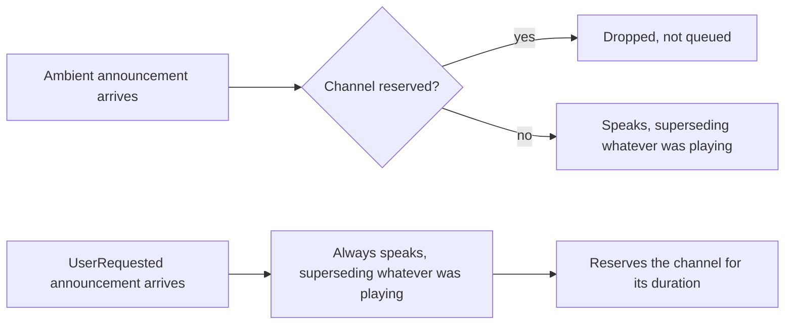
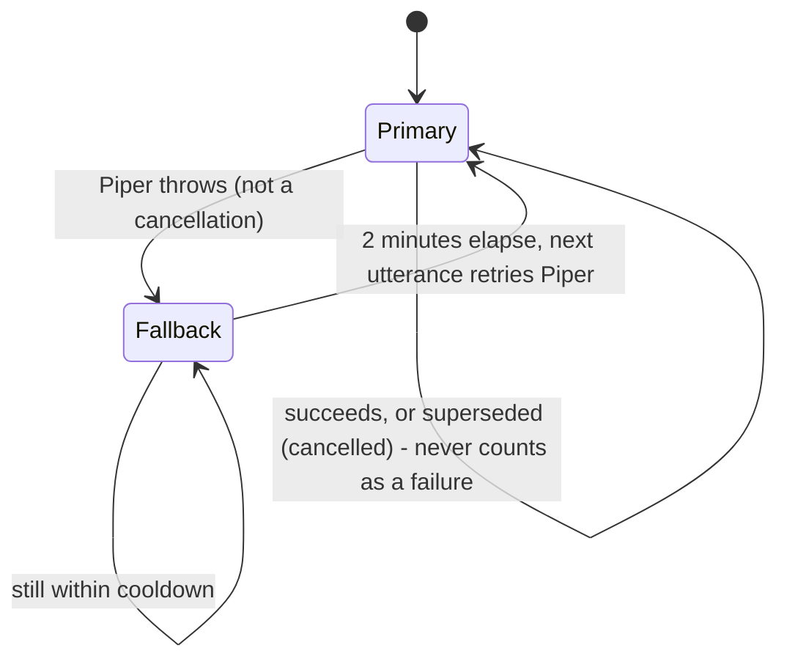
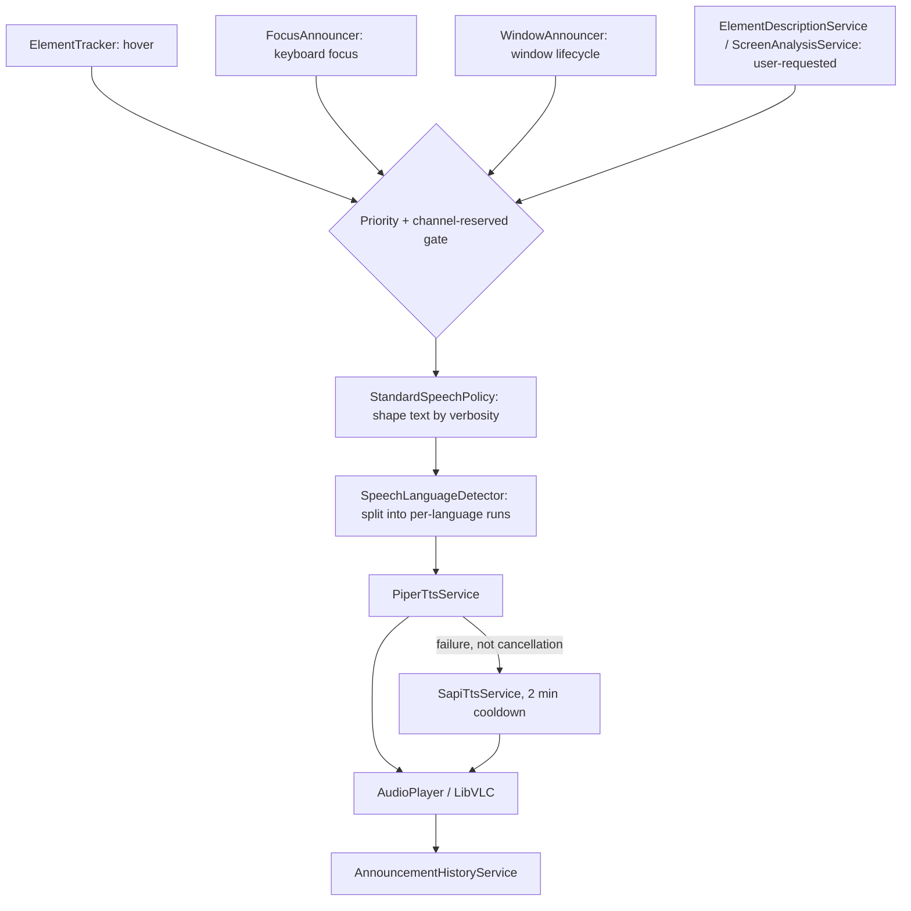

# Speech / Announcement Strategy

How Peek decides whether to speak, what to say, in which voice and language, and how one
announcement supersedes another.

## Three ambient sources, one arbitration point

Three independent producers watch the desktop and may want to speak:

| Source | Trigger | Settle throttle | Setting |
| --- | --- | --- | --- |
| `ElementTracker` | mouse hover | 300ms (`HoverThrottleMs`) | `AnnounceOnHover` |
| `FocusAnnouncer` | keyboard focus change | 120ms (`FocusThrottleMs`) | `AnnounceOnFocus` |
| `WindowAnnouncer` | window opened/closed/activated | none | `WindowAnnouncement.Enabled` (off by default) |

All three follow the same shape: `Where(setting enabled) → Throttle(settle window) →
Select(query + speak) → Switch()`. `Switch()` makes this an interruption model, not a queue - a
newer event cancels the in-flight query/announcement for the previous one outright rather than
letting it finish late. `ElementTracker` also de-duplicates via `HoverElementIdentityComparer`
(worker `ElementId` when present, else hwnd+AutomationId+Name+ControlType+Rect), so a stationary
cursor over one control doesn't re-announce it. `FocusAnnouncer` filters out Peek's own windows
and anonymous full-screen containers (a maximized window's unnamed root pane, which some apps
report as "focused" and which is meaningless spoken or highlighted).

All three call the same entry point, `IAccessibilitySpeechService.AnnounceAsync(element,
SpeechPriority.Ambient)` / `AnnounceTextAsync(text, SpeechPriority.Ambient)` - the arbitration
below is shared.

## Priority: two classes, drop don't queue

```csharp
enum SpeechPriority { Ambient, UserRequested }
```

- **Ambient** - Peek volunteered this (hover/focus/window events), cheap and about to be
  superseded anyway.
- **UserRequested** - the answer to something the user explicitly did (AI element description,
  AI screen/window analysis). Never dropped; reserves the channel for its duration.

Asymmetric on purpose: an ambient announcement arriving while the channel is reserved is dropped,
not queued. A queue turns one interruption into a backlog - a delayed "button, Save" arriving
several seconds late describes where the mouse was, not where it is.



"Channel reserved" (`AccessibilitySpeechService.IsChannelReserved`) is true while either a
`UserRequested` utterance is in flight (`_userUtteranceInFlight`), or an exclusive lease is held
(`BeginExclusive(reason, onStopRequested)`).

The lease exists for multi-sentence streamed narration: `ScreenAnalysisService` holds one for the
whole AI screen/window analysis, not per sentence, so an ambient hover landing between two
streamed sentences can't cut the answer in half. `onStopRequested` is how the global stop-speaking
hotkey (`Ctrl+Alt+S`) cancels in-progress AI narration specifically.

Every new `SpeakAsync` call cancels whatever the previous call was doing (`_ttsCts` swapped and
the old one cancelled) before proceeding, regardless of priority - a second ambient announcement
supersedes a first one too, not just user-requested-over-ambient.

## Content: policy-shaped, not a property dump

`StandardSpeechPolicy.Describe(element, verbosity, culture)` builds the spoken sentence from a
`SemanticElement`, adding only what the current `SpeechVerbosity` calls for:

| Verbosity | Includes |
| --- | --- |
| `Minimal` | Name only |
| `Standard` (default) | Name, role, state |
| `Detailed` | + Value (only if it differs from Name), keyboard shortcut |
| `Verbose` | + Description |

Role and state are spoken only when they add information; a redundant or empty value is dropped
rather than announced as "blank." Only Peek's own scaffolding words ("button", "checked",
"checkbox") are localized (`SpeechStrings`/Lingua .resx) - the inspected app's own name/value is
spoken as-is.

## Language: per-utterance, not per-session

`SpeechLanguageDetector.Segment(text, primaryLanguage)` tags each character run as Chinese
(Unicode CJK ranges) or the configured primary language; digits/punctuation/whitespace inherit
whichever language surrounds them, so a phone number embedded in an English sentence reads in
English, and one in a Chinese sentence in Chinese.

`Settings.Localization.TtsLanguage` (falling back to `UiLanguage`, then English) is independent
of the UI's display language - reading the UI in one language and listening in another is a
supported combination. Each language run goes to `Peek.Worker.Tts` with its own Piper voice
(`SpeechSettings.VoiceIdByLanguage`: `en`/`de`/`zh` ship by default).

## Synthesis: neural first, Windows voices as a safety net



- **Primary**: `PiperTtsService` - local, offline neural voices (Piper/onnxruntime), one voice
  model per language, downloaded on first use.
- **Fallback**: `SapiTtsService` - Windows' built-in voices, so a fresh offline install still
  speaks immediately. Matches the requested language prefix against installed Windows voices; if
  none is installed, the OS default voice is used (which may be a different language, decided by
  what's installed, not by Peek).
- `FallbackTtsService` only demotes on a genuine synthesis failure - a cancellation (an utterance
  superseded by a newer one, routine during normal use) is explicitly not a failure, so ordinary
  interruption traffic can't trip the 2-minute Piper cooldown.

Playback is a single shared `LibVLC` `MediaPlayer` (`AudioPlayer`): only one clip plays at a
time, and `Stop()` is the supersession mechanism - never a mix or a queue.

Every spoken utterance's text (not audio) is appended to `AnnouncementHistoryService`'s capped
transcript, so a user can review or copy what was just read.

## End-to-end



## Open findings

1. **A cancelled-by-supersession call looks like an error in the client log.** A worker RPC
   cancelled server-side comes back as `RpcResponse.Failure(..., RpcErrorCodes.Timeout,
   "Cancelled")`, which `RpcResponseExtensions.ThrowIfError` turns into a plain
   `WorkerRpcException`, not an `OperationCanceledException`. `AccessibilitySpeechService.SpeakAsync`
   only treats a real `OperationCanceledException` as the expected supersession case, so this
   path falls into the generic `catch (Exception ex)` and logs an ERROR for routine traffic (any
   fast hover/focus interruption). Not incorrect, just noise that could mask a real failure -
   worth having the catch (or `WorkerRpcException`) recognize this error code as benign.
2. **The `_ttsCts` swap in `SpeakAsync` isn't synchronized.** `ElementTracker`'s hover pipeline
   and `FocusAnnouncer`'s focus pipeline are independent Rx subscriptions, each with its own
   `Switch()`, so nothing prevents both from calling `SpeakAsync` at the same moment (e.g. focus
   changes via Tab right as the mouse settles). The read-modify-cancel-dispose sequence on
   `_ttsCts` has no lock; two concurrent callers could cancel/dispose the same `oldCts`, or one
   caller's new `CancellationTokenSource` could be silently orphaned - a small leak, not a crash.
   Not seen in a crash report, but worth a lock or `Interlocked.Exchange` if it surfaces.
