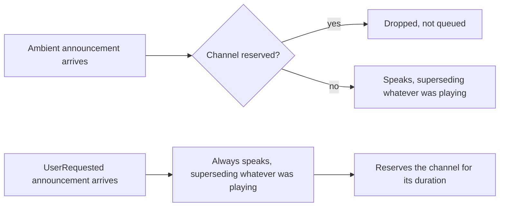
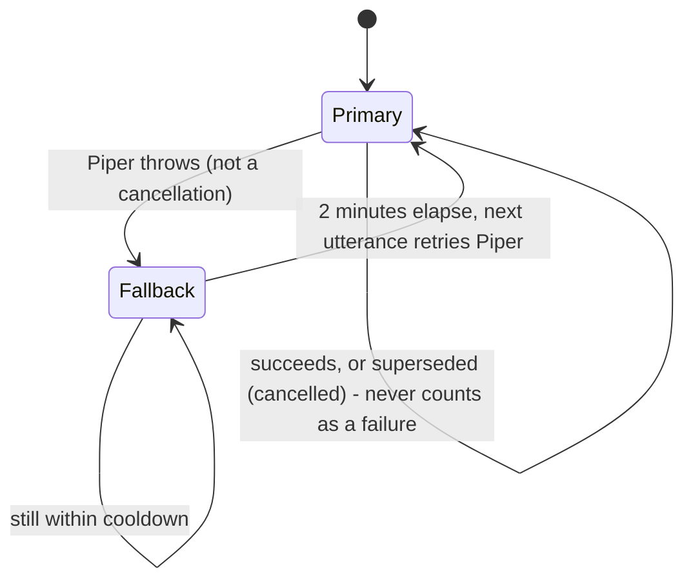
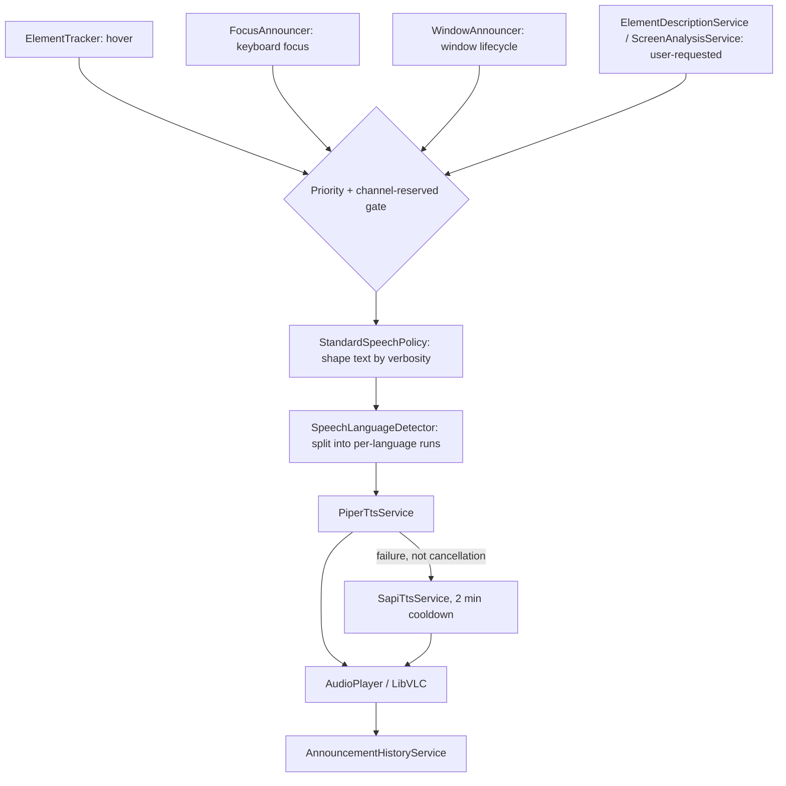

# Speech / Announcement Strategy

How Peek decides *whether* to speak, *what* to say, *in which voice and language*, and how one
announcement supersedes another - not a plain "read whatever the cursor touches" loop.

## Three ambient sources, one shared arbitration point

Three independent producers watch the desktop and each may want to speak:

| Source | Trigger | Settle throttle | Setting |
| --- | --- | --- | --- |
| `ElementTracker` | mouse hover | 300ms (`HoverThrottleMs`) | `AnnounceOnHover` |
| `FocusAnnouncer` | keyboard focus change | 120ms (`FocusThrottleMs`) | `AnnounceOnFocus` |
| `WindowAnnouncer` | window opened/closed/activated | none | `WindowAnnouncement.Enabled` (off by default) |

All three follow the same shape: `Where(setting enabled) -> Throttle(settle window) ->
Select(query + speak) -> Switch()`. `Switch()` is what makes this an interruption model rather
than a queue - as soon as a newer event arrives, the in-flight query/announcement for the
previous one is cancelled outright rather than left to finish late. `ElementTracker` additionally
de-duplicates via `HoverElementIdentityComparer` (worker `ElementId` when present, else
hwnd+AutomationId+Name+ControlType+Rect) so a stationary cursor over one large control doesn't
re-announce it, and `FocusAnnouncer` filters out Peek's own windows and anonymous full-screen
containers (a maximized window's unnamed root pane, which some apps hand back as "focused" and
which is meaningless both spoken and highlighted).

All three end up calling the same entry point,
`IAccessibilitySpeechService.AnnounceAsync(element, SpeechPriority.Ambient)` /
`AnnounceTextAsync(text, SpeechPriority.Ambient)` - the arbitration below is what they share.

## Priority: two classes, drop don't queue

```csharp
enum SpeechPriority { Ambient, UserRequested }
```

- **Ambient** - Peek volunteered this (hover/focus/window events). Cheap, constant, and about to
  be superseded anyway.
- **UserRequested** - the answer to something the user explicitly did (AI element description,
  AI screen/window analysis). Never dropped, and reserves the channel for as long as it runs.

The rule is asymmetric on purpose: an ambient announcement that arrives while the channel is
reserved is **dropped, not queued**. A queue would turn one interruption into a backlog - by the
time a delayed "button, Save" got its turn, it would describe where the mouse was several
seconds ago, which is worse than never saying it.



"Channel reserved" (`AccessibilitySpeechService.IsChannelReserved`) is true while either:
- a `UserRequested` utterance is in flight (`_userUtteranceInFlight` counter), or
- an **exclusive lease** is held (`BeginExclusive(reason, onStopRequested)`).

The lease exists for multi-sentence streamed narration: `ScreenAnalysisService` holds one for
the whole AI screen/window analysis, not per sentence, so an ambient hover landing in the gap
between two streamed sentences can't cut the answer in half. The lease's `onStopRequested`
callback is how the global "stop speaking" hotkey (`Ctrl+Alt+S`) can cancel an in-progress AI
narration specifically, ahead of anything else.

Regardless of priority, every new `SpeakAsync` call cancels whatever the *previous* call was
doing (`_ttsCts` is swapped and the old one cancelled) before proceeding - this is what makes a
second ambient announcement supersede a first one too, not just user-requested-over-ambient.

## Content: policy-shaped, not a property dump

`StandardSpeechPolicy.Describe(element, verbosity, culture)` builds the spoken sentence from a
`SemanticElement`, adding only what the current `SpeechVerbosity` calls for:

| Verbosity | Includes |
| --- | --- |
| `Minimal` | Name only |
| `Standard` (default) | Name, role, state |
| `Detailed` | + Value (only if it differs from Name), keyboard shortcut |
| `Verbose` | + Description |

Role and state are only spoken when they add information - a redundant or empty value is
dropped rather than announced as "blank". Only Peek's own scaffolding words ("button",
"checked", "checkbox") are localized (via `SpeechStrings`/Lingua .resx); the element's own
name/value, coming from the inspected app, is spoken exactly as-is.

## Language: per-utterance, not per-session

`SpeechLanguageDetector.Segment(text, primaryLanguage)` walks the announced text character by
character and tags each run as Chinese (Unicode CJK ranges) or the configured primary language;
digits/punctuation/whitespace carry no signal of their own and inherit whichever language
surrounds them, so a phone number embedded in an English sentence is read in English, and one
embedded in a Chinese sentence in Chinese - never forced into the "wrong" language regardless of
context.

`Settings.Localization.TtsLanguage` (falling back to `UiLanguage`, then English) is independent
of the UI's own display language - reading the UI in one language and listening in another is a
deliberate, supported combination. Each language run is sent to `Peek.Worker.Tts` with its own
Piper voice (`SpeechSettings.VoiceIdByLanguage`: `en`/`de`/`zh` ship by default).

## Synthesis: neural first, Windows voices as a safety net



- **Primary**: `PiperTtsService` - local, offline neural voices (Piper/onnxruntime), one voice
  model per language, downloaded on first use (the one place "local-first" means "local after a
  one-time fetch," not fully offline from install).
- **Fallback**: `SapiTtsService` - Windows' own built-in voices, so a fresh install with no
  network still speaks immediately. Matches the requested language prefix against installed
  Windows voices; if none is installed for that language, the OS default voice is used instead
  (which may be a different language than requested - the SAPI voice pack actually installed is
  what decides this, not Peek).
- `FallbackTtsService` only demotes to the fallback engine on a genuine synthesis failure - a
  cancellation (the utterance being superseded by a newer one, which happens constantly during
  normal use) is explicitly not treated as failure, so ordinary interruption traffic can never
  trip the 2-minute Piper cooldown.

Playback is a single shared `LibVLC` `MediaPlayer` (`AudioPlayer`): only one clip plays at a
time by construction, and `Stop()` is the supersession mechanism - interrupting an announcement
is "stop the player, start the next clip," never a mix or a queue.

Every spoken utterance's text (not audio) is appended to `AnnouncementHistoryService`'s
capped transcript (`AnnouncementHistory.MaxCharacters`), so a user can review or copy what was
just read instead of relying on memory.

## End-to-end



## Findings (not fixed, flagging as requested)

1. **Cancelled-by-supersession looks like an error in the client-side log.** A worker RPC
   cancelled server-side comes back as `RpcResponse.Failure(..., RpcErrorCodes.Timeout,
   "Cancelled")`, which `RpcResponseExtensions.ThrowIfError` turns into a plain
   `WorkerRpcException` on the client - not an `OperationCanceledException`. Since
   `AccessibilitySpeechService.SpeakAsync` only treats a real `OperationCanceledException` as
   the expected "superseded by a newer announcement" case, this specific path falls through to
   the generic `catch (Exception ex) { _logger.LogError(...) }` and logs an ERROR for what is
   completely routine traffic (any fast hover/focus interruption). Not incorrect behavior, just
   log noise that could mask a real failure - worth having `WorkerRpcException` (or the catch in
   `SpeakAsync`) distinguish this specific error code and treat it as the benign case it is.
2. **`_ttsCts` swap in `AccessibilitySpeechService.SpeakAsync` isn't synchronized.** `ElementTracker`'s
   hover pipeline and `FocusAnnouncer`'s focus pipeline are two independent Rx subscriptions with
   their own `Switch()`, so nothing prevents both from calling `SpeakAsync` at genuinely the same
   moment (e.g. focus changes via Tab right as the mouse settles on a different element). The
   read-modify-cancel-dispose sequence on `_ttsCts` has no lock around it; two concurrent callers
   could read the same `oldCts` and both cancel/dispose it, or one caller's new
   `CancellationTokenSource` could be silently overwritten and orphaned (a small leak, not a
   crash) before ever being observed. Low severity and not seen in a crash report so far, but
   worth a lock or `Interlocked.Exchange` around the swap if it ever does surface.
